<p align="center">
  
</p>

# claude-founder-brand

> Replace a $4K-8K/mo ghostwriter with a voice-aware content engine
> you control.

LinkedIn-native posts on the **Pillar / Proof / Process / Person**
4-pillar framework. 12-week content engine planning. Draft critique
against the JMC voice rubric — refuses thought-leader voice, refuses
LinkedIn-influencer cadence, refuses AI-detection signals.

Based on the **[JMC Founder-Brand Compounding](https://jaymountconsulting.com/learn/courses/founder-brand-compounding)**
course. No LLM calls inside the skill itself.

[](LICENSE)
[](https://github.com/cmj-hub/claude-founder-brand)


<p align="center">
  
</p>


## What it does

```mermaid
graph LR
    A["/founder-brand"] --> B{Kickoff: state check}
    B -->|First time| C[Onboarding<br/>voice + 4 pillars]
    B -->|Have config| D[Content / LinkedIn-craft]
    C --> D
    D --> E[Score Post<br/>script]
    E -->|≥70| F[Operator publishes]
    E -->|<70| D

    style C fill:#1a1a2e,stroke:#00d4ff
    style E fill:#1a1a2e,stroke:#cc4714
```



## The 4 sub-skills

| Sub-skill | What it does |
|---|---|
| `founder-brand-kickoff` | Adaptive router — detects state (brand-config? voice fingerprints? stories reservoir? this week's queue?) |
| `founder-brand-onboarding` | 15-min interactive setup → brand-config.json + SOUL.md with voice + 4-pillar pools |
| `founder-content` | Generate a single LinkedIn post on a specific pillar with 1 of 5 hook archetypes |
| `linkedin-craft` | LinkedIn-specific format, hook variants, draft critique |

## The deterministic script

| Script | Job |
|---|---|
| `scripts/score_post.py` | Score any post 0-100 across 6 axes (hook strength, specificity, voice fingerprints, anti-patterns, format-for-skim, receipt presence). Catches AI-detection phrases ("delve into", "in today's fast-paced world"), engagement bait ("What's your take?"), thought-leader voice ("Stop. Read this."), and operator's own banned list. |

Verified:
- Strong founder-voice post → 96/100 (caught contrarian hook + receipts + format)
- AI-pattern post with "delve into" + "fast-paced world" + "What's your take?" → 40/100

## The 3-tier config

```
brand-config.json   ← Audience + 4-pillar topic pools + cadence + drive-to URLs
SOUL.md             ← Voice in 3 sentences + phrases-I-use + phrases-I-refuse + stories reservoir
AGENTS.md           ← Refuses generic posts, refuses engagement bait, refuses fabricated receipts
```

**The skill refuses to generate posts without SOUL.md.** The whole
point is sounding like YOU.

## Install

### Claude Code

```bash
/plugin marketplace add cmj-hub/claude-founder-brand
/plugin install founder-brand
```

### One-line install

```bash
curl -fsSL https://raw.githubusercontent.com/cmj-hub/claude-founder-brand/main/install.sh | bash
```

## The 4-pillar framework

| Pillar | Job | Example |
|---|---|---|
| **Pillar** | Big claim / POV / contrarian | "Most outbound programs blame the SDRs. The real issue is upstream." |
| **Proof** | Case study / metric / receipt | "Series-B SaaS hit 14 SQLs in 30 days from a PSP rewrite." |
| **Process** | How you do the work / SOP | "Our 7-step PSP construction, with the 3 places teams get stuck." |
| **Person** | Human story / stake | "I shipped 3 outbound programs that failed before I figured out the PSP layer." |

Rotate weekly. Don't do all four in one week.

## The 5 hook archetypes

Every first line does one of these:

1. **Contrarian** — "Most teams do X. The lever is actually Y."
2. **Specific receipt** — "<Metric>: <number> in <timeframe>. The lever wasn't <obvious>."
3. **Confession** — "I used to think X. After N failed attempts I figured out Y."
4. **Pattern observation** — "I've reviewed N <thing>. One pattern keeps showing up."
5. **Question reframe** — "Stop asking <usual Q>. Ask <better Q> instead."

If your first line doesn't match one of these, the skill flags it.

## Cost arbitrage

| Role | $ range | What you'd outsource |
|---|---|---|
| LinkedIn ghostwriter (mid) | $4K-8K/mo | 8-12 posts/month |
| Personal brand agency | $8K-15K/mo | Full content engine + community management |
| Content strategist | $10K-20K/mo | Strategy + writing + posting |

This skill produces drafts in your voice. You publish. It does NOT
replace the doing (you still have to live the stories). It DOES
replace the writing-by-someone-else-who-doesn't-sound-like-you
problem that ghostwriting solves badly.

## Plugs into

- **[cmj-hub/claude-psp](https://github.com/cmj-hub/claude-psp)** — Process pillar content often maps to PSP work
- **[cmj-hub/claude-evp](https://github.com/cmj-hub/claude-evp)** — Pillar pillar (big claims) is often a Tier 2 EVP reformatted
- **[cmj-hub/claude-cold-email](https://github.com/cmj-hub/claude-cold-email)** — Proof pillar content makes great cold-email opener material

## Course

→ [jaymountconsulting.com/learn/courses/founder-brand-compounding](https://jaymountconsulting.com/learn/courses/founder-brand-compounding)

Want it all-access? **[Operator Pass](https://jaymountconsulting.com/operator-pass)**.

## License

MIT. Built by [Jay Mount Consulting](https://jaymountconsulting.com).
